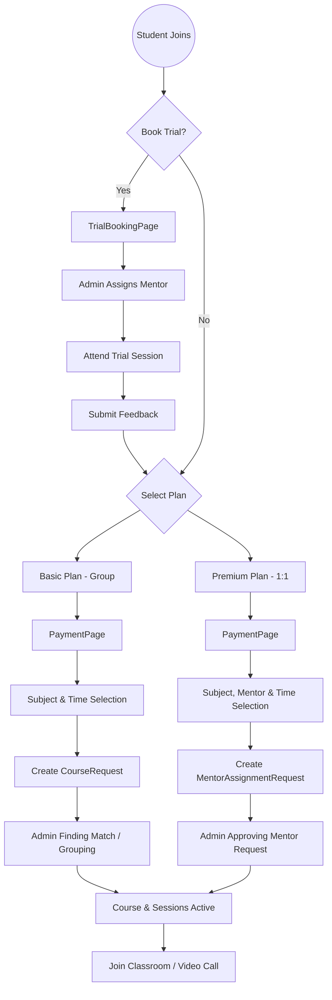

# Platform Architecture Analysis & Student Journey

## 1. Overview
The platform is designed to handle different classes of learning experiences tailored to subscription tiers:
- **Basic Plan**: Group classes with fixed weekend slots.
- **Premium Plan**: Personalized 1-to-1 sessions with mentor choice and flexible scheduling.

---

## 2. Integrated System Flow Mappings

### A. Trial Class Flow
**Journey**: Registration → Trial Booking → Attendance → Feedback
- **Frontend**: `TrialBookingPage.tsx`, `selectTimeSlot.tsx`, `TrialFeedback.tsx`
- **API**: `requestTrialClass`, `submitFeedback` (Student API)
- **Backend Service**: `TrialClassService.ts`
- **Database Model**: `TrialClass` (student, subject, mentor, status, preferredDate/Time)

### B. Subscription & Onboarding Flow
**Journey**: Dashboard → Subscription Plans → Payment → Preferences
- **Frontend**: `SubscriptionPlans.tsx`, `PaymentPage.tsx`
- **API**: `getActivePlans`, `createPaymentIntent` (Payment/Subscription API)
- **Backend Service**: `SubscriptionService.ts`, `PaymentService.ts`
- **Database Model**: `Student` (subscription field), `Plan`

### C. Course Request Flow (Group Classes - Basic)
**Journey**: Subject Selection → Time Slot Selection → Dashboard
- **Frontend**: `SubjectsSelectionPage.tsx`, `TimeSlotsSelectionPage.tsx`
- **API**: `updatePreferences` (Student Service)
- **Backend Logic**: Creates one `CourseRequest` per subject.
- **Database Model**: `CourseRequest` (mentoringMode: 'group')

### D. Mentor Assignment Request Flow (1:1 Classes - Premium)
**Journey**: Subject Selection → Mentor Selection → Time Slot Selection → Dashboard
- **Frontend**: `SubjectsSelectionPage.tsx`, `MentorSelectionPage.tsx`, `TimeSlotsSelectionPage.tsx`
- **API**: `requestMentor` (Student Service)
- **Backend Logic**: Creates a `MentorAssignmentRequest`.
- **Database Model**: `MentorAssignmentRequest` (mentoringMode: 'one-to-one')

### E. Admin Matching & Course Creation
**Journey**: Admin Dashboard → Course Requests / Mentor Requests → Approval
- **Frontend**: `courseRequests.tsx`, `FindMatchModal.tsx`, `MentorRequestsPage.tsx`
- **API**: `approveRequest` (Mentor Request Service)
- **Backend Service**: `MentorRequestService.ts`
- **Database Model**: Generates `Course` (Enrollment), `EnrollmentLink`, and recurring `Session` objects.

---

## 3. Student Preference Storage
Student preferences are stored in two primary locations depending on the plan:

1.  **Direct Student Profile (`Student` Model)**:
    - `preferredSubjects`: Array of Subject IDs.
    - `preferredTimeSlots`: Array of objects containing `subjectId`, `status`, and `slots` (Day, Start/End Time).
    - **Usage**: Primary source for scheduling for both plans.

2.  **Request Objects**:
    - **Basic Plan**: Preferences are replicated into `CourseRequest` objects to be processed by the admin.
    - **Premium Plan**: The specific mentor Choice is stored in `MentorAssignmentRequest`.

---

## 4. Admin Page Data Dependencies

| Admin Page | Model Read | Primary Action |
| :--- | :--- | :--- |
| `CourseRequestsPage` | `CourseRequest` | Matching students to group classes or assigning mentors to group requests. |
| `MentorRequestsPage` | `MentorAssignmentRequest` | Approving specific 1-to-1 mentor requests. |
| `StudentsPage` | `Student` | Managing student profiles and subscription statuses. |
| `MentorsPage` | `Mentor` | Managing mentor availability and proficiency. |

---

## 5. Detected Data Silos & Inconsistencies

### Silo: CourseRequest vs. MentorAssignmentRequest
- **Issue**: The admin interface for "Course Requests" (Group) and "Mentor Requests" (1:1) are entirely decoupled.
- **Impact**: If a student is on a Premium plan but their preference logic triggers a `CourseRequest` (e.g., due to a fallback or UI edge case), the admin might match them to a group class via `CourseRequestsPage` without seeing their specific mentor preference stored in `MentorAssignmentRequest`.
- **Inconsistency**: `CourseRequest` stores `preferredDays` as an array of strings, while `MentorAssignmentRequest` relies on the `Student` model's `preferredTimeSlots` which uses a more complex nested object structure.

### Silo: Preference Synchronization
- **Issue**: Preferences in the `Student` model are not automatically synced with open `CourseRequest` objects if updated later.
- **Impact**: Admin might fulfill a request using stale preference data if the student updates their profile but the request object isn't refreshed.

---

## 6. System Flow Diagram (Student Journey)

